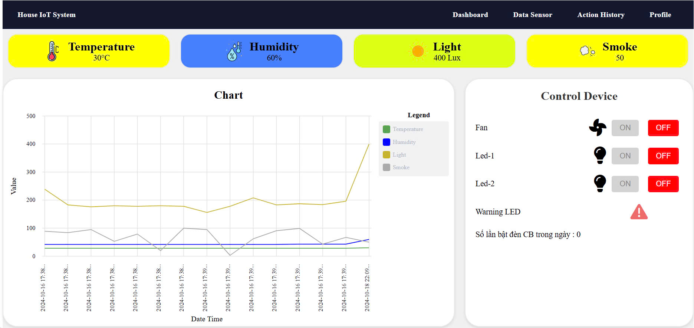
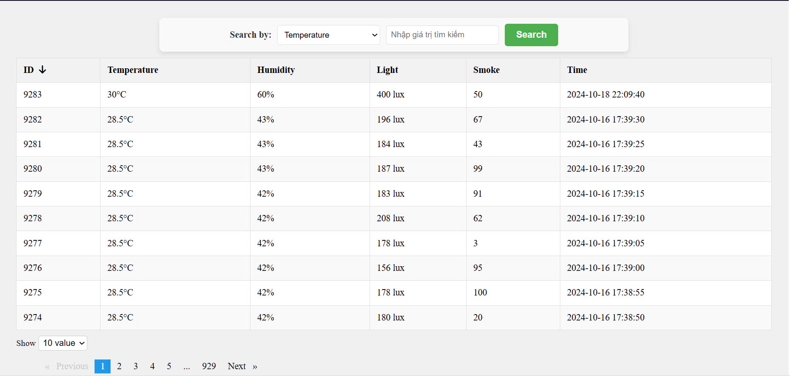
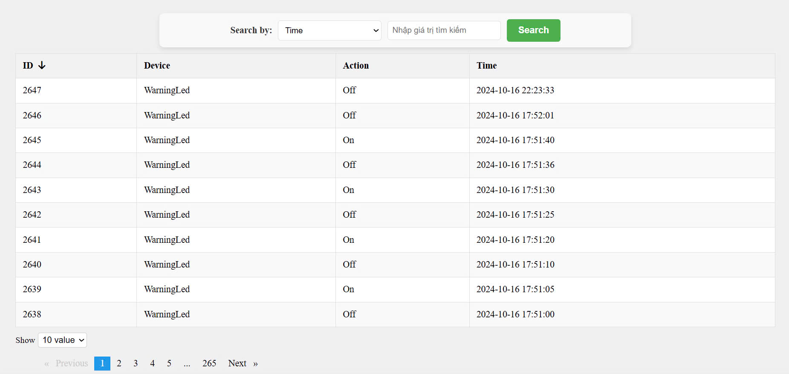
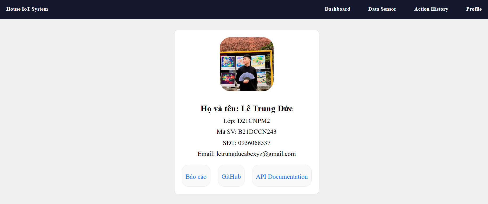

# Web IoTSystem

## Giới thiệu
Dự án này là một hệ thống IoT cho phép giám sát nhiệt độ, độ ẩm, ánh sáng,... và điều khiển các thiết bị như quạt, bóng đèn, điều hòa,.. thông qua giao thức MQTT.

Hệ thống bao gồm:
- **Arduino**: Điều khiển phần cứng như cảm biến và các thiết bị thông qua MQTT.
- **FrontEnd**: Sử dụng Angular 18 để hiển thị dữ liệu real-time và điều khiển các thiết bị.
- **Backend**: Sử dụng Java Spring Boot để xử lý dữ liệu từ Arduino gửi đến và thực hiện các yêu cầu từ phía Frontend.
- **Database**: Sử dụng MySQL để lưu trữ dữ liệu.
- **MQTT**: Sử dụng để pub/sub dữ liệu giữa các thiết bị và hệ thống.

### Yêu cầu hệ thống:
- **Node.js**: >= 18.x
- **Angular CLI**: >= 18.x
- **Java**: >= 17.x
- **Maven**: >= 3.x
- **MQTT Broker**: Mosquitto hoặc bất kỳ MQTT Broker nào

## Hướng dẫn cài đặt và chạy dự án

### Cài đặt các package

####  Cài đặt Frontend (Angular)
1. Clone dự án
2. Di chuyển vào thư mục client: `cd home_iot_system_FE`.
3. Cài đặt dependencies: `npm install`.

#### Backend (NodeJS)
1. Mở Command Prompt.
2. Di chuyển vào thư mục server: `cd iot_system_BE`.
3. Cài đặt dependencies: `npm install`.

### Chạy dự án

#### Backend (NodeJS)
1. Mở Command Prompt.
2. Di chuyển vào thư mục server: `cd home_iot_system_FE`.
3. Khởi động Server: `mvn spring-boot:run`.
   

#### Frontend (ReactJS)
1. Mở Command Prompt.
2. Di chuyển vào thư mục client:  `cd iot_system_BE`.
3. Khởi động ứng dụng: `npm start`.

### Giao diện Web

- **Dashboard**
  

- **Data Sensor**
  

- **Action History**
  

- **Profile**
  
